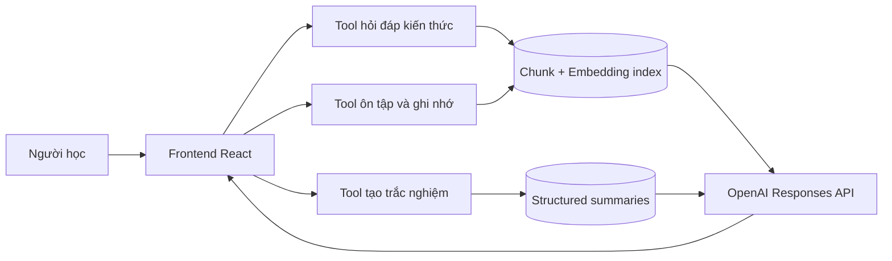
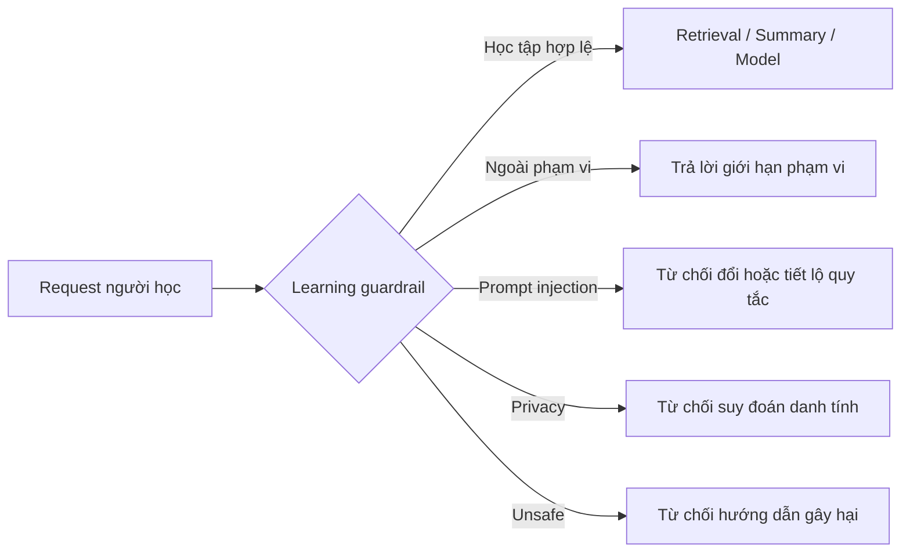
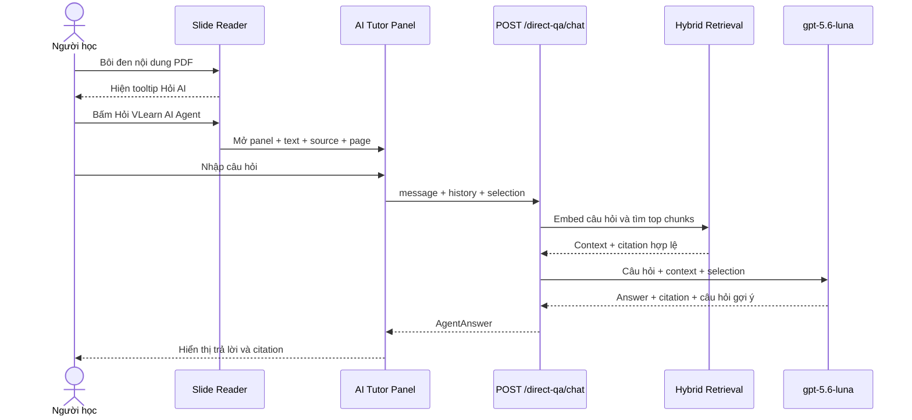
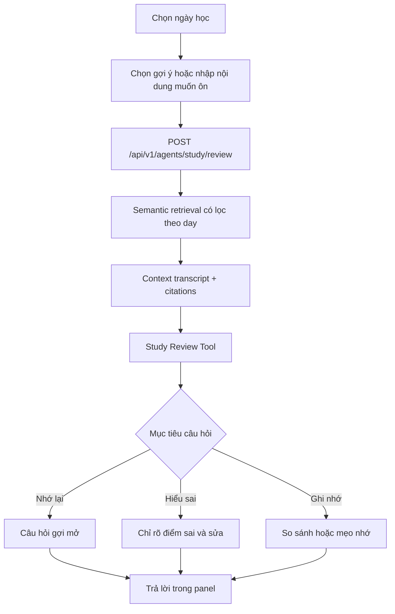
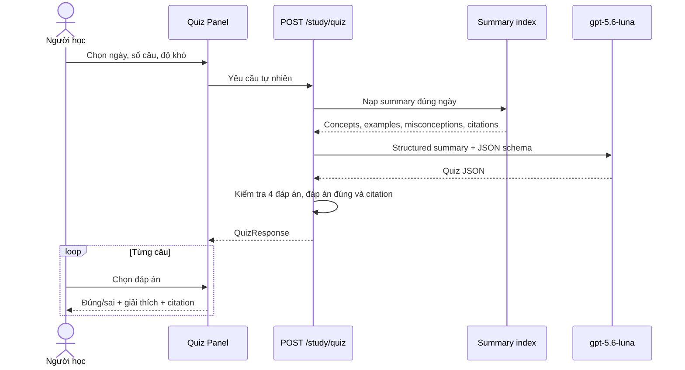
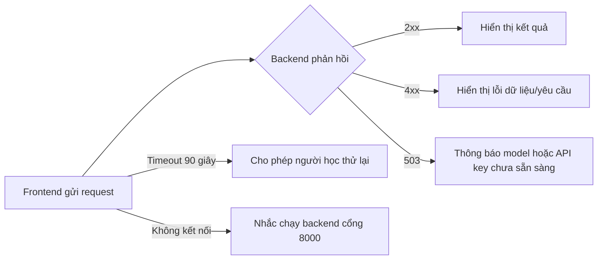

# Luồng hoạt động 3 tính năng AI của VLearn

## Tổng quan

Backend chỉ sử dụng hai loại dữ liệu đã xử lý:

- `backend/data/processed/embeddings`: retrieval cho hỏi đáp và ôn tập.
- `backend/data/processed/summaries`: nguồn có cấu trúc để tạo quiz.

Mọi request đi qua guardrail cục bộ trước khi gọi embedding hoặc model. Các
nhóm bị chặn gồm: ngoài phạm vi học tập, prompt injection/đánh cắp prompt, xâm
phạm dữ liệu cá nhân và hướng dẫn nguy hiểm.

## 1. Hỏi đáp kiến thức trong lúc đọc

Người học có hai cách mở cùng một panel hỏi đáp:

1. Bấm nút AI nổi để hỏi kiến thức bình thường.
2. Bôi đen nội dung slide, bấm **Hỏi VLearn AI Agent** và hỏi về đoạn đã chọn.

Selection từ PDF chỉ được chấp nhận khi:

- `source` là tên một slide có thật trong data backend.
- Có `page` hợp lệ.
- Selection chỉ làm context bổ sung, không được dùng làm citation.

## 2. Hỏi đáp ôn tập và ghi nhớ

Tab **Ôn tập** có phạm vi Ngày 1/Ngày 2 và các lối vào gợi ý như tự kiểm
tra, so sánh khái niệm và tạo mẹo nhớ. Tool này dùng cùng knowledge index với
hỏi đáp thường nhưng có prompt sư phạm khác.

Lịch sử hội thoại được gửi tối đa 12 message gần nhất từ frontend; backend
giới hạn tối đa 20 message.

## 3. Trắc nghiệm kiểm tra hiểu bài

Người học cấu hình ngày học, số câu và độ khó ngay trong tab **Trắc nghiệm**.
Quiz được tạo từ summary có cấu trúc, không lấy trực tiếp từ đoạn retrieval.

## Trạng thái lỗi chung

## File triển khai chính

- `frontend/src/components/SlideReaderView.jsx`: đọc PDF và bắt selection.
- `frontend/src/components/AiTutorPanel.jsx`: ba giao diện AI.
- `frontend/src/services/vlearnApi.js`: giao tiếp với FastAPI.
- `backend/app/tools/knowledge_qa.py`: hỏi đáp kiến thức.
- `backend/app/tools/study_review.py`: ôn tập và ghi nhớ.
- `backend/app/tools/generate_quiz.py`: tạo trắc nghiệm.
